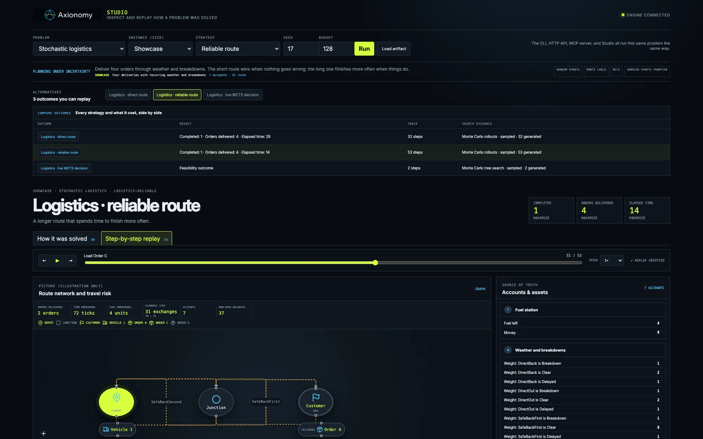
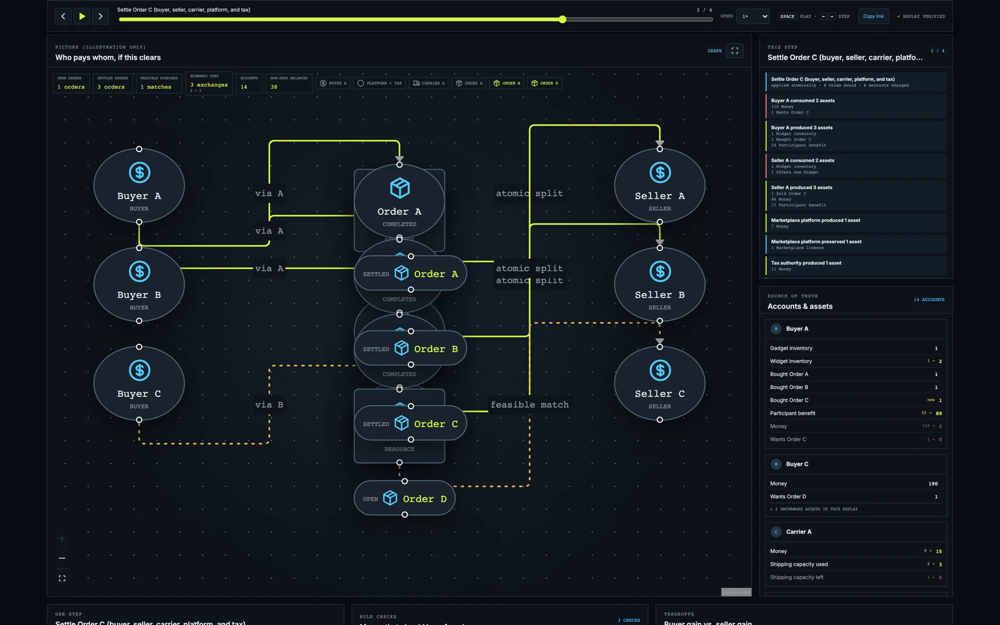
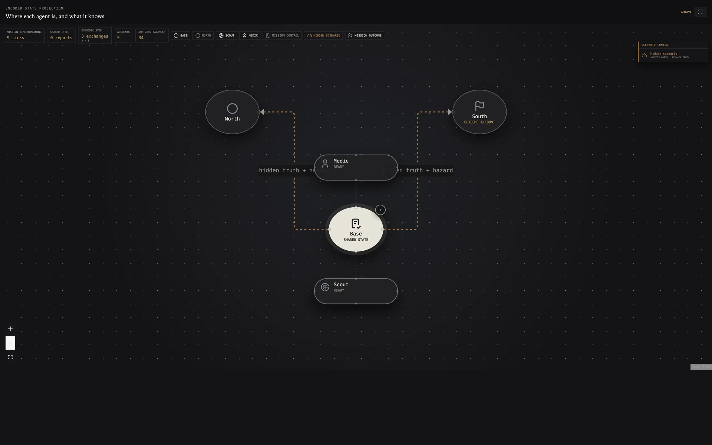
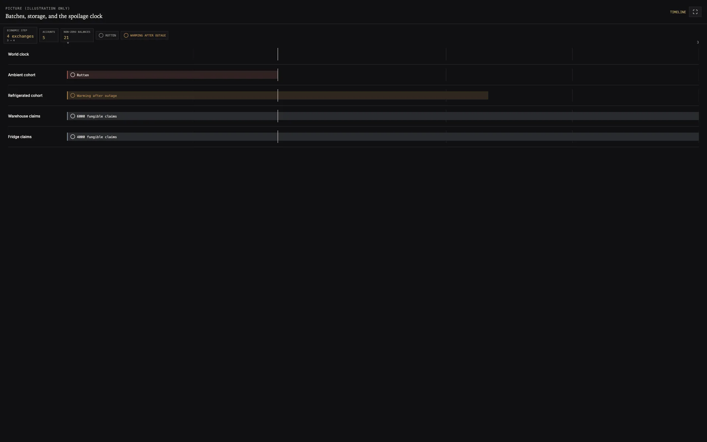

<picture>
  <source media="(prefers-color-scheme: dark)" srcset="assets/axionomy-logo-dark.webp">
  <source media="(prefers-color-scheme: light)" srcset="assets/axionomy-logo-light.webp">
  
</picture>

> A closed economy for verifiable problem solving.

**Everything is an asset. Every change is an exchange.**

Axionomy treats every problem as an economy. Assets represent anything that can
exist or matter, including resources, facts, permissions, beliefs, goals, and
state. Accounts define where those assets belong, rates define the laws by
which they may change, and exchanges are the only events that make those
changes real. Search algorithms, optimizers, simulations, and policies may
explore this economy and propose exchanges, but they never own its truth; the
economy remains the single authoritative model, making every accepted decision
inspectable, verifiable, and replayable.

Because every transition exposes explicit preconditions, shortfalls, consumed
resources, preserved facts, produced outcomes, and invariant violations,
Axionomy provides much denser feedback than a sparse success-or-failure
signal—especially for reinforcement learning, where it can supply valid-action
masks, intermediate progress, resource costs, and structured failure reasons.
The same encoding can also serve graph search, optimization, Monte Carlo
simulation, and learned policies without duplicating domain logic; exact forks
enable counterfactual exploration, while replayable traces make decisions
auditable, comparable, and independently verifiable.

[](https://biomaai.github.io/axionomy/)

<p align="center"><sub>Axionomy Studio compares stochastic logistics strategies, then replays the selected solution one verified exchange at a time. <a href="https://biomaai.github.io/axionomy/">Open the live Studio</a>.</sub></p>

Try the
[Autonomous Work League](https://biomaai.github.io/axionomy/?problem=work_league&instance=showcase&strategy=mixed_field&document=work_league%3Amixed_field&view=replay&step=24&leaderboard=resource_efficiency&seed=17&budget=128)
to see several agents lead different replay-derived rankings at the same
economic step.

Axionomy is a Rust engine for encoding bounded problem spaces through four
primitives:

| Primitive | Meaning |
| --- | --- |
| Asset | A resource, fact, proposition, capability, condition, memory item, or state token |
| Account | An owner, actor, location, scope, or namespace |
| Rate | A law describing what may be consumed, produced, and preserved |
| Exchange | One concrete, role-bound firing of a rate |

The non-negotiable rule is:

> Nothing semantically authoritative may live outside assets, accounts, rates,
> and exchanges.

There is no parallel `WorldState`. Position, topology, time, goals, machine
capacity, uncertainty, beliefs, random seeds, bids, and rewards are modeled in
the same closed state. Search and optimization algorithms may fork that state
and propose exchanges, but only the core can accept a transition.

```text
State       = Account × Asset → Quantity<N>
Problem     = Initial accounts + available rates + declared invariants
Computation = A sequence of valid exchanges
Goal        = A required asset configuration
Solution    = A replayable exchange trace reaching that configuration
```

Fungibility follows asset identity rather than a privileged token class. A
balance of `10_000 × Claim(CohortA)` is one fungible quantity, while
`Condition(CohortA, Fresh) = 1` is a unique state fact whose lifecycle is
protected by rates and invariants. This also supports non-fungible goods by
giving each item a unique asset identity and conserving its unit supply. When
many holders share one fate, their balances can remain stable claims while a
single cohort or pool account carries the authoritative condition or epoch.

See [PDD.md](PDD.md) for the product and technical contract,
[PROBLEMS.md](PROBLEMS.md) for the conformance problems that drive the API,
[AGENT_BENCHMARK.md](AGENT_BENCHMARK.md) for the future single- and multi-agent
evaluation and rating design, and
[CONTINUOUS_AGENT_SYSTEMS.md](CONTINUOUS_AGENT_SYSTEMS.md) for the boundary
between the Work Utility System and the Autonomy Harness that owns agents,
learning, deployment, and assurance.

The thirteen reference problems expose explicit **Micro**, **Showcase**, and
**Stress** instances. Micro keeps exact fixtures and independent oracles fast;
Showcase is the default that Studio and the generated artifacts use. Stress
raises a domain-relevant dimension—sampling, topology, board size, horizon,
uncertainty, coupled participants, or inventory. This keeps examples honest
without turning arbitrary size into a product claim, and it lets CLI, HTTP,
MCP, and Studio identify exactly which closed economy produced an outcome.

## Workspace

The repository separates execution semantics, solver strategies, and domain
models into one-way workspace dependencies:

| Crate | Responsibility |
| --- | --- |
| `axionomy` | Pure closed-state validation and exchange execution kernel |
| `axionomy-search` | Non-authoritative graph and Pareto search, rollout, Monte Carlo, perfect-information and information-set MCTS, and learning projections |
| `axionomy-problems` | Canonical problem encodings, specialized proposers, and conformance tests |
| `axionomy-units` | Self-describing asset denominations, schema coherence, and dimension-safe `uom` authoring |
| `axionomy-time` | Calendar-aware Jiff authoring over the same canonical timeline denominations |
| `axionomy-mcp` | Strict stateless MCP 2026-07-28 reference server with caller-owned snapshot storage and interruptible search tasks |
| `axionomy-view` | Runtime-neutral, replay-derived browser presentation contracts |
| `axionomy-service` | Interface-neutral catalog, run control, progress, and replay-derived artifacts for every canonical problem |
| `axionomy-cli` | Human- and script-friendly access to the shared problem service |
| `axionomy-studio-server` | Native OpenAPI/SSE reference backend and in-memory run orchestration for Axionomy Studio |
| `axionomy-studio-wasm` | Single-threaded Web Worker adapter for running the same Rust service in a browser |

```text
axionomy-search ──────→ axionomy
axionomy-problems ────→ axionomy
                    └─→ axionomy-search
axionomy-units ───────→ axionomy
axionomy-time ────────→ axionomy-units ──→ axionomy
axionomy-view ────────→ axionomy
axionomy-service ─────→ axionomy-problems + axionomy-view
axionomy-cli ─────────→ axionomy-service
axionomy-mcp ─────────→ axionomy-service + axionomy-search + axionomy
axionomy-studio-server → axionomy-service
axionomy-studio-wasm ──→ axionomy-service
```

The kernel does not depend on a solver, problem, unit, or time crate. The
packages are independently publishable: release `axionomy` first; search and
units may follow; time follows units; problems and view follow the reusable
layers; the service follows those; CLI, MCP, HTTP, and Studio remain outer
adapters.

## What is implemented

### Kernel

- User-defined asset, account, rate-ID, role, and checked `Quantity<N = u64>` types.
- Atomic multi-account exchanges with consume, produce, and preserve baskets.
- Explanatory assessments, complete shortfalls, projected deltas, and receipts.
- Declared invariants, asset-configured goals, isolated forks, and deterministic replay.
- Stable Serde models plus optional `BigUint`, dimension-safe `uom`, and Jiff authoring.

### Search

- BFS, Dijkstra, A*, best-first, branch-and-bound, rollouts, and weighted sampling.
- Exact Pareto search and sampled multi-objective policy comparison.
- Reproducible Monte Carlo, vector-valued MCTS, and observation-scoped ISMCTS.
- Resumable sessions with work budgets, progress, interruption, and RL trajectories.

### Interfaces

- One service contract shared by CLI, HTTP/SSE, MCP, Studio, and browser Wasm.
- Thirteen discoverable problems with explicit Micro, Showcase, and Stress instances.
- Snapshot leaderboards whose exact ranks, tradeoffs, and evidence update during replay.
- A strict stateless MCP 2026-07-28 server with caller-owned snapshot storage.
- Rust-owned OpenAPI, generated TypeScript, portable artifacts, and cross-interface tests.

### Studio

- Live search progress plus saved solver observations for fast and slow runs.
- Replay-derived accounts, assessments, receipts, rule inspection, and actor views.
- Graph, grid, matrix, and timeline pictures with semantic icons and exact metrics.
- Strategy comparison, Pareto tradeoffs, rule checks, native SSE, and Web Worker Wasm.
- Shareable deep links to any problem, strategy, evidence view, replay step, and leaderboard.

The core contains no application ontology or search algorithm. Problem assets
and specialized solvers compile against the same public kernel API available
to users.

## Multi-objective decisions without a second truth

Axionomy can expose every non-dominated outcome instead of forcing a caller to
hide tradeoffs inside one weighted score. A result dominates another only when
it is no worse on every declared objective and strictly better on at least one.
Objective values are read from terminal account balances—energy spent, process
time, participant utility, retained credit, completion time, preserved
inventory—not invented by the search. The search-layer schema supplies names
and minimize/maximize direction as disposable decision policy; it cannot make
an invalid exchange valid or alter an outcome.

This produces a more useful tradeoff view for allocation, planning, and
learning. Callers can inspect who benefits, defer the final tradeoff until
preferences are known, preserve discrete or non-convex alternatives that a
weighted sum can miss, and use the retained set as dense supervision for a
policy or reinforcement learner. Every exact entry carries a trace that is
replayed from the source economy. Exhaustive finite search is labeled `Exact`
only after completion; interrupted search and Monte Carlo policy fronts remain
visibly `Approximate`.

## Inspect with Axionomy Studio

Axionomy Studio is a universal economic debugger and trace player, not a
second simulator. It scrubs a trace by replaying accepted exchanges through
the Rust core, then shows the resulting accounts, assets, assessments,
receipt deltas, objectives, semantic transition cues, and an optional read-only
picture. Its separate Solve view follows bounded solver observations
live and retains them in the artifact, so even a sub-second run remains
inspectable. The Maze graph, Sokoban and Connect Four grids, Exact Cover
matrix, scheduling and perishables timelines, market and logistics networks,
stochastic telemetry,
Pareto alternatives, rejected proposals, and actor-relative observations are
all views over that same truth; none can make an exchange valid.
Deliberately invalid or infeasible proposals appear under **Moves that should
be refused**, with structured role, account, asset, and rate diagnostics. They
demonstrate that the rules are active and are kept visually separate
from genuine run or transport failures.

### Reading Studio

- Assets and accounts appear under **Source of truth**.
- Rates, roles, goals, and invariants appear under **The rules**.
- Each applied exchange appears under **One step** and in the replay scrubber.
- Goals become outcome objectives; competing outcomes appear under **Tradeoffs**.

Studio, the CLI, the HTTP API, and MCP deliberately call the same
interface-neutral service. Their different usability demands pressure one
shared catalog, request, progress, control, and artifact API. A capability is
promoted toward the core only when it is independent of transport and
presentation and belongs to economic validation or replay; interface-specific
state stays outside. Cross-interface tests compare complete artifacts so the
four surfaces cannot quietly acquire different semantics.

```console
cargo run -p axionomy-studio-server --bin axionomy-studio
cd studio
pnpm install
pnpm dev
```

Open `http://127.0.0.1:5173`. The native server is optional: when it is healthy,
Studio uses HTTP/SSE and exposes pause, resume, and cancellation; otherwise it
loads the same Rust service as WebAssembly in an isolated Worker and keeps Run
enabled for all thirteen problems. Worker cancellation is immediate by
terminating that disposable worker. If WebAssembly cannot initialize, the
committed Showcase artifacts still provide read-only playback. The status badge
is backed by a current health/initialization check rather than by a catalog that
may have been cached earlier.

The repository deploys the browser engine and static artifacts to
`https://biomaai.github.io/axionomy/` from `main` through the Pages workflow.
GitHub Pages requires no application server and no cross-origin isolation: the
engine is intentionally single-threaded inside a Worker. See
[`studio/README.md`](studio/README.md) for contract generation and verification.

The same service is available without a browser:

```console
cargo run -p axionomy-cli -- catalog
cargo run -p axionomy-cli -- describe logistics
cargo run -p axionomy-cli -- run logistics --instance showcase --strategy reliable
```

## Studio gallery

Each view below is derived from the same accounts, assets, rates, exchanges,
receipts, and replay contract used by the engine—never from a parallel
simulation model. Click any image for the full-resolution view.

<table>
  <tr>
    <td width="50%">
      <a href="assets/studio-gallery/logistics.webp"></a><br>
      <strong>Stochastic logistics</strong><br>
      Monte Carlo policy comparison, MCTS evidence, random travel events, and a replayed route through four deliveries.
    </td>
    <td width="50%">
      <a href="assets/studio-gallery/marketplace.webp"></a><br>
      <strong>Multi-party marketplace</strong><br>
      Atomic settlement across buyers, sellers, carriers, platform, and tax, with exact Pareto utility tradeoffs.
    </td>
  </tr>
  <tr>
    <td width="50%">
      <a href="assets/studio-gallery/mission.webp"></a><br>
      <strong>Hidden-information mission</strong><br>
      Private observations, shared beliefs, random hazards, and information-set search across cooperating agents.
    </td>
    <td width="50%">
      <a href="assets/studio-gallery/perishables.webp"></a><br>
      <strong>Perishable inventory</strong><br>
      Ten thousand fungible claims, cohort-level decay, cooling energy, timed effects, and exact inventory tradeoffs.
    </td>
  </tr>
</table>

## Core example

```rust
use axionomy::{
    Account, EconomyBuilder, Exchange, Goal, LinearInvariant, Quantity, Rate,
    basket,
};

#[derive(Debug, Clone, Copy, PartialEq, Eq, Hash, PartialOrd, Ord)]
enum Asset {
    Raw,
    Finished,
    Tool,
    Solved,
}

#[derive(Debug, Clone, Copy, PartialEq, Eq, Hash, PartialOrd, Ord)]
enum AccountId {
    Workshop,
    Success,
}

#[derive(Debug, Clone, Copy, PartialEq, Eq, Hash, PartialOrd, Ord)]
enum Role {
    Shop,
    Goal,
}

#[derive(Debug, Clone, Copy, PartialEq, Eq, Hash, PartialOrd, Ord)]
enum RateId {
    Build,
    Finish,
}

let mut economy = EconomyBuilder::new()
    .account(
        AccountId::Workshop,
        Account::from(basket([(Asset::Raw, 2), (Asset::Tool, 1)])),
    )
    .account(AccountId::Success, Account::default())
    .rate(
        RateId::Build,
        Rate::new()
            .consume(Role::Shop, basket([(Asset::Raw, 2)]))
            .preserve(Role::Shop, basket([(Asset::Tool, 1)]))
            .produce(Role::Shop, basket([(Asset::Finished, 1)])),
    )
    .rate(
        RateId::Finish,
        Rate::new()
            .preserve(Role::Shop, basket([(Asset::Finished, 1)]))
            .produce(Role::Goal, basket([(Asset::Solved, 1)]))
            .distinct(Role::Shop, Role::Goal),
    )
    .invariant(
        LinearInvariant::new("material")
            .weight(Asset::Raw, 1)
            .weight(Asset::Finished, 2),
    )
    .build()?;

let build = Exchange::new(RateId::Build, Quantity::new(1))
    .bind(Role::Shop, AccountId::Workshop);
let assessment = economy.assess(&build);
assert!(assessment.is_applicable());
assert_eq!(
    assessment
        .projected_deltas()
        .expect("applicable exchanges project their receipt deltas")
        .len(),
    1,
);
economy.apply(build)?;
economy.apply(
    Exchange::new(RateId::Finish, Quantity::new(1))
        .bind(Role::Shop, AccountId::Workshop)
        .bind(Role::Goal, AccountId::Success),
)?;

let goal = Goal::new().require(
    AccountId::Success,
    basket([(Asset::Solved, 1)]),
);
assert!(economy.matches(&goal));
# Ok::<(), Box<dyn std::error::Error>>(())
```

The `Build` exchange is valid only if every role binding, balance,
preservation requirement, arithmetic operation, and invariant succeeds.
`assess` explains validity without mutation: feasible exchanges expose the
same per-account deltas later confirmed by their receipt, while infeasible
exchanges expose every account-and-asset shortfall. The core prepares all
affected accounts first and commits all of them together.

## Exact values and typed authoring

An asset defines what a value means and names its atomic economic basis;
`Quantity<N>` defines how its exact non-negative coefficient is represented.
The default backend is `u64`, while the `bigint` feature supports exact
non-`Copy` `BigUint` economies without changing model semantics.

Unit-aware models use `UnitAsset<Id>` as their actual asset key. An
`AssetSchema` declares each logical ID once as discrete or measured, and the
key carries the physical dimension, stable `uom` quantity kind, and exact
atomic basis through equality, hashing, ordering, and Serde. Inputs may be
expressed in any compatible unit, but every account, basket, rate, invariant,
and goal stores the same canonical atoms. Conflicting definitions cannot
silently alias and the schema-backed model build rejects them. Jiff uses this
same representation, so calendar and physical-time authoring cannot create
competing clocks outside the economy.

The typed `uom` and Jiff adapters currently require the resulting atom count to
fit `u64` before converting it into the economy's selected `Quantity<N>`
backend. `BigUint` removes the core economy's arithmetic ceiling, but it does
not expand this authoring-adapter conversion boundary.

```console
cargo run --features bigint --example bigint
cargo run -p axionomy-units --example cargo_mass
cargo run -p axionomy-time --example calendar_window
```

Model types serialize directly through Serde and preserve stable insertion
order for readable, repeatable output. Deserialization passes through the same
canonical construction rules: zero balances are removed and duplicate
identifiers are rejected. This ordinary serialization is intentionally not
claimed as a versioned compatibility protocol. The MCP reference server hashes
the exact current serialized bytes to identify immutable snapshots inside its
store; that deployment handle is not a promise that future schema versions
will produce the same ID.

## Stateless MCP reference server

`axionomy-mcp` demonstrates how a remote, interruptible Axionomy integration
can remain faithful to the closed model. It keeps no hidden “current economy.”
`axionomy_economy_put` returns an immutable `economy_id`; assessment names that
snapshot, while apply and replay return a new ID and leave the source
available. `axionomy_search` accepts an explicit candidate exchange universe
and returns an MCP task handle whose progress, terminal result, and cooperative
cancellation are observable for the lifetime configured by the running server.

Snapshot lifetime is caller policy. `AxionomyMcp<S>` accepts any
`SnapshotStore`; the reference binary uses `MemorySnapshotStore`, whose clones
share immutable content-addressed snapshots for one process. A restarted
reference server intentionally starts empty. Applications that genuinely need
longer-lived handles can provide database or object-store implementations
without changing the MCP tools or the core engine.

The server accepts only MCP `2026-07-28`, disables legacy sessions, and
requires the revision's request metadata and standard HTTP routing headers.
Task state, queues, progress counters, and snapshot handles are operational
artifacts—not a parallel world model. Search still reaches successors only by
applying concrete exchanges through the kernel, and its completed result is a
replayable trace.

```console
cargo run -p axionomy-mcp --bin axionomy-mcp

# Full stateless HTTP lifecycle, including task polling:
cargo test -p axionomy-mcp --test http
```

See [crates/axionomy-mcp/README.md](crates/axionomy-mcp/README.md) for the tool
contract, deployment limits, and integration details.

## Conformance problems

| Problem | Encoded concepts | Compared strategies |
| --- | --- | --- |
| Key-door maze | Topology, position, lock, key, energy, time, heuristic, goal | BFS, Dijkstra, A*, exact energy/time Pareto front |
| Sokoban | Cell occupancy, push legality, deadlock | BFS and infeasibility |
| Exact cover | Universe, subsets, coverage, selection | BFS and Algorithm X |
| Workshop | Recipes, catalysts, material, labor, waste, process time | BFS, waste minimization, exact waste/time Pareto front |
| Job shop | Precedence, identified machine slots, makespan, per-job completion | Best-first, branch search, direct oracle, exact allocation Pareto front |
| Rescue | Hidden truth, seed, observation, belief, chance, sensor use | Exact scenario evaluation, seeded Monte Carlo, approximate policy front |
| Bridge | Capacity, bids, escrow, priority, joint resolution | BFS, first-come, auction, exact priority/credit Pareto front |
| Marketplace | Buyers, sellers, carriers, tax, commission, competing orders, participant utility | Assessment matching, replayable clearing, exact allocation Pareto front |
| Logistics | Orders, routes, fuel, time, weather, breakdown, repair | Long rollouts, risk-aware Monte Carlo, route MCTS, approximate policy front |
| Connect Four | Identified cells, gravity, turns, line counts, wins, draw | Vector-valued MCTS with plain-board/minimax oracles |
| Mission | Private views, caller-owned beliefs, causal shared intelligence, hazard, treatment | Repeated observation-scoped ISMCTS, scenario/MC evaluation, approximate policy front, RL trajectories |
| Perishables | Fungible cohort claims, unique condition facts, deadlines, refrigeration, power loss, cooling energy | Receipt-maintained index, event agenda, exact storage Pareto front, independent oracle |
| Work League | Autonomous workers, finite jobs, travel, shared facilities, resources, recycling, failures and repairs | Competing seeded policies; value, throughput, efficiency, waste, reliability, and Pareto standings after every step |

Every accepted result is an exchange trace replayed by the same core. The
specialized algorithms are proposers, not alternate execution engines.

These are concrete examples and conformance fixtures, not reusable maze,
scheduler, marketplace, or game frameworks. Users create their own economies.
The suite's purpose is to prove that the common assets/accounts/rates/exchange
axioms generalize and to expose friction that belongs in domain-independent
engine APIs. Rate names never authorize bindings: where identity matters, the
rates require preserved identity or capability assets, and adversarial tests
construct incorrect bindings directly to prove the core rejects them.

Every problem has a small consumer-facing example. The example binaries contain
no domain rules: they instantiate their concrete economy, invoke strategies,
replay the proposed trace, assert the encoded goal, and print a summary.

```console
cargo run -p axionomy-problems --example maze
cargo run -p axionomy-problems --example sokoban
cargo run -p axionomy-problems --example exact_cover
cargo run -p axionomy-problems --example workshop
cargo run -p axionomy-problems --example scheduling
cargo run -p axionomy-problems --example rescue
cargo run -p axionomy-problems --example bridge
cargo run -p axionomy-problems --example marketplace
cargo run -p axionomy-problems --example logistics
cargo run -p axionomy-problems --example connect_four
cargo run -p axionomy-problems --example mission
cargo run -p axionomy-problems --example perishables
cargo run -p axionomy-problems --example work_league
```

All runnable examples use structured console logging. `INFO` presents model
construction, strategy decisions, encoded outcomes, and verification;
`RUST_LOG=debug` adds detailed traces, assessments, or canonical denomination
definitions as appropriate. Each example binary installs its own subscriber.
The reusable libraries never install a global subscriber or treat logs as
authoritative state.

A repeatable long-horizon workload is also available:

```console
cargo bench -p axionomy-problems --bench rollout_throughput
```

For example, the maze's default `INFO` view is:

```text
INFO Compare shortest-depth BFS with energy-aware A* over one encoded graph. example="Maze"
INFO encoded economy ready accounts=2 rates=8
INFO proposal replayed strategy="BFS" exchanges=3 expanded=5 goal_verified=true
INFO proposal replayed strategy="A*" exchanges=6 expanded=6 energy=6 goal_verified=true
INFO exact search retained every non-dominated route completeness=Exact outcomes=2 terminal_outcomes=2 expanded=10
INFO non-dominated route energy=9 time=3 exchanges=3 replay_verified=true
INFO non-dominated route energy=6 time=6 exchanges=6 replay_verified=true
```

## Semantics in brief

For exchange units `n`, consume and produce baskets scale by `n`. A preserved
basket is an unscaled read threshold: it must exist, but it is not consumed.
This makes a batched exchange observationally consistent with sequential
firings that reuse the same catalyst or fact.

For every affected account:

```text
required = consume × n + preserve
next     = current - consume × n + produce × n
```

All quantities are checked. Every declared linear invariant must have the same
measure before and after. A failure leaves the economy unchanged.

## Development

Axionomy uses Rust Edition 2024 and supports Rust 1.89 or newer. It relies on
mature ecosystem crates for ordered maps, serialization, exact numeric traits,
typed units, civil time, randomness, statistics, pathfinding, errors, property
testing, benchmarking, and structured example diagnostics while keeping
semantic authority in the four core primitives.

```console
cargo test --workspace --all-targets --all-features
cargo test --workspace --doc --all-features
cargo clippy --workspace --all-targets --all-features -- -D warnings
cargo fmt --all -- --check
RUSTDOCFLAGS="-D warnings" cargo doc --workspace --all-features --no-deps
cargo bench --workspace --no-run
cargo package -p axionomy
cargo package -p axionomy-search --list
cargo package -p axionomy-units --list
cargo package -p axionomy-time --list
cargo package -p axionomy-problems --list
cargo package -p axionomy-mcp --list
```

Until `axionomy` is available from a registry, Cargo cannot perform an
ordinary registry-resolution dry run for the dependent packages. CI can
verify their package archives using local `[patch.crates-io]` overrides; their
source manifests retain both path and version requirements for normal
workspace development and future ordered publication.
